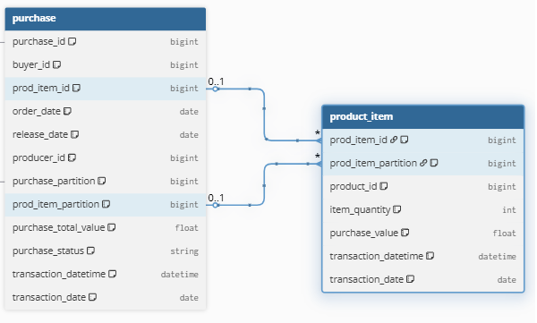

# Exercício 1 — SQL

## Modelo de Dados e Relacionamentos

  

### Estrutura das Tabelas

A tabela `product_item` possui uma chave primária composta por `prod_item_id` e `prod_item_partition`, estabelecendo um relacionamento com a tabela `purchase` através dessas mesmas chaves.

### Considerações para Cálculo

Para garantir a integridade do cálculo de faturamento ao usar **JOIN** entre as tabelas, é essencial que:

- A tabela `purchase` possua registros únicos considerando as chaves `prod_item_id` e `prod_item_partition`
- O valor total de cada compra seja obtido a partir da **soma dos itens** que a compõem

---

## Query 1 — Top 50 produtores por faturamento em 2021

### Pergunta de negócio

Quais foram os 50 produtores que mais faturaram na plataforma ao longo de 2021?

### Regras de negócio aplicadas

- Apenas compras efetivamente concluídas são consideradas, identificadas pelo campo `release_date IS NOT NULL`
- O faturamento é calculado com base:
  - na quantidade de itens vendidos
  - multiplicada pelo valor unitário de cada item
- O recorte temporal considera apenas compras realizadas no ano de **2021**

### Lógica de cálculo

1. Realiza-se o **JOIN** entre as tabelas `purchase` e `product_item`
2. O faturamento é calculado por meio da soma de `item_quantity * purchase_value`
3. Os valores são agregados no nível de produtor
4. Os produtores são ordenados de forma decrescente pelo faturamento total

### Resultado esperado

Uma lista ordenada contendo os **50 produtores** com maior faturamento em 2021.

---

## Query 2 — Top 2 produtos que mais faturaram por produtor

### Pergunta de negócio

Quais são os 2 produtos que mais faturaram para cada produtor?

### Regras de negócio aplicadas

- Apenas compras concluídas são consideradas (`release_date IS NOT NULL`)
- O faturamento do produto é calculado:
  - somando todas as vendas do produto
  - dentro do contexto de cada produtor
- Para cada produtor, os produtos são ordenados pelo faturamento
- Apenas os **2 produtos** mais relevantes em faturamento são retornados

### Lógica de cálculo

1. Calcula-se o faturamento agregado no nível `produtor + produto`
2. Aplica-se uma **window function** para ranquear os produtos por faturamento dentro de cada produtor
3. São selecionados apenas os produtos com melhor desempenho financeiro (Top 2)

### Resultado esperado

Para cada produtor, uma lista contendo seus **2 produtos** com maior faturamento.