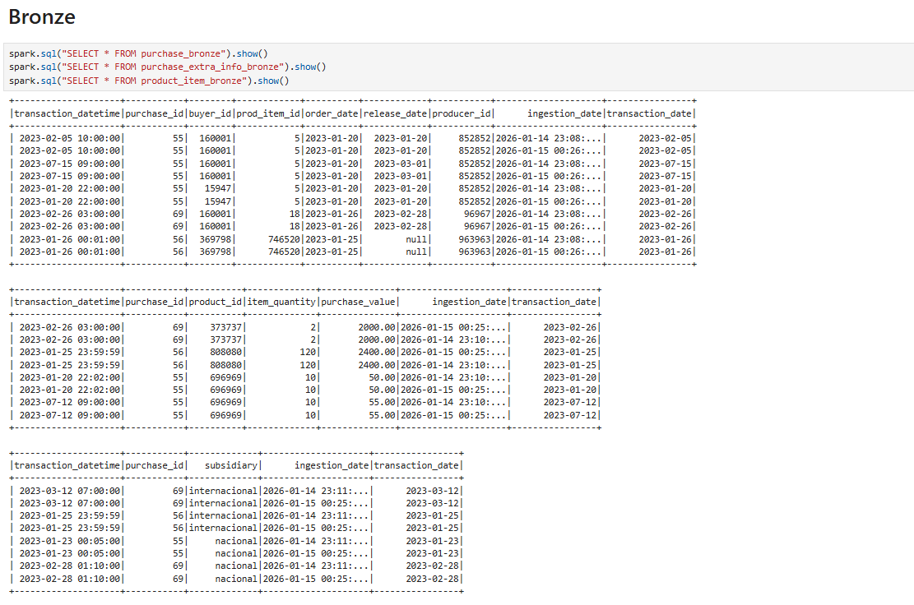
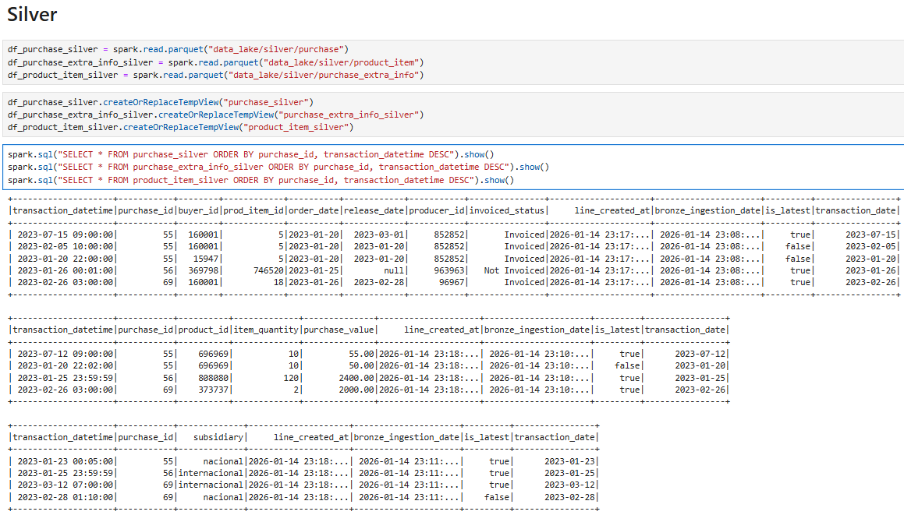
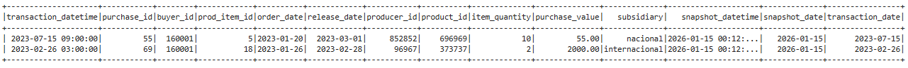
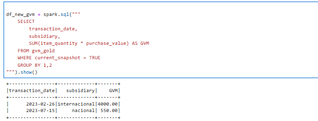

# Exercício 02 - Modelagem e desenvolvimento

## Observações
  Não foi possível configurar, dentro do prazo, o ambiente necessário para utilizar a engine Delta Lake no Spark. Essa seria a abordagem ideal, pois facilitaria a implementação de operações de merge e o gerenciamento incremental dos dados no Data Lake.
  
  Diante dessa limitação, optei por utilizar Parquet como formato de armazenamento das tabelas do Data Lake, simulando os processos de merge por meio de union e deduplicação com window functions.

  Além disso, o cenário ideal incluiria a configuração de um orquestrador, como o Airflow, para explicitar as dependências entre as etapas do pipeline (Bronze → Silver → Gold), controlar execuções incrementais e garantir observabilidade do processo. Neste projeto, apresento apenas a proposta teórica de como essa orquestração poderia ser estruturada, considerando os pré-requisitos definidos.

## Instalação e Configuração

### Pré-requisitos do Sistema
- Docker e Docker Compose instalados.

### Configuração do Ambiente
1. Clone ou navegue para o diretório do projeto.
2. Acesse a pasta infra e execute:
    - 2.1 `docker compose build
    - 2.2 `docker compose up -d` para iniciar o container Spark.
3. Execute `docker compose up -d` para iniciar o container Spark.
4. Acesse o Jupter Notebook em `localhost:8888` - utilizando o `Token`: 1234
5. Acesso o Spark UI em `localhost:4040` (Opcional)

## Descrição do Projeto

  Este projeto implementa um Data Lake baseado na arquitetura Medalhão (camadas Bronze, Silver e Gold) para processamento e análise de dados de eventos de produtos e compras da plataforma Hotmart. O processamento foi desenvolvido utilizando Apache Spark em ambiente local. 
  A infraestrutura foi configurada com Docker Compose, e o desenvolvimento e execução dos scripts ocorreram por meio de Jupyter Notebook, garantindo reprodutibilidade e isolamento do ambiente.
  ***A entrega final será uma tabela no schema `gold` alimentada com snpashots diários para que o usuário consiga navegar pelos resultados de diferentes cargas/dias***.

## Arquitetura Medalhão

### Bronze Layer
- **Propósito**: Ingestão de dados brutos diretamente das fontes de eventos.
- **Características**: Dados são armazenados no formato original, sem transformações significativas, apenas ajuste de schema. Inclui tratamento básico de inconsistências.
- **Escrita**: Incremental
- **Tabelas**:
  - `product_item`: Dados de itens de produtos.
  - `purchase`: Dados de compras.
  - `purchase_extra_info`: Informações extras sobre compras.



### Silver Layer
- **Propósito**: Limpeza, normalização e enriquecimento dos dados.
- **Características**: Dados são validados, duplicatas removidas e tipos de dados padronizados.
- **Lógica**: União da tabela atual com novos dados da bronze em relação ao último registro da tabela bronze armazenado na tabela silver e deduplicação com window functions.
- **Escrita**: Sobrescrita mantendo histórico
- **Tabelas**:
  - `product_item`: Dados limpos de itens de produtos.
  - `purchase`: Dados limpos de compras.
  - `purchase_extra_info`: Informações extras limpas.



### Gold Layer
- **Propósito**: Tabela resultante da aplicação das regras de negócio, com dados padronizados e organizados, visando facilitar o uso e a interpretação pelas áreas da empresa.
- **Características**: Construídas a partir de relacionamentos de tabelas da camada silver, agregadas ou analíticas.
- **Lógica**: Snapshot diário. União da tabela atual com o novo snapshot das tabelas silver, deduplicação com window functions, garantindo que não haverão registros iguais nos diferentes snapshots.
- **Escrita**: Sobrescrita mantendo histórico
- **Tabelas**:
  - `gvm` (Gross Value Metric)



## Estrutura do Projeto

```
exercicio_02/
├── infra/                                      # Configuração da infraestrutura
│   ├── Dockerfile                              # Container Spark com Jupyter
│   ├── docker-compose.yml                      # Orquestração de serviços
│   └── workspace/                              # Volume compartilhado com dados
├── workspace/                                  # Dados e notebooks do projeto
│   ├── data_lake/                              # Repositório de dados estruturado
│   │   ├── bronze/                             # Camada de ingestão bruta
│   │   │   ├── product_item/                   # Eventos de itens de produtos
│   │   │   ├── purchase/                       # Eventos de compras
│   │   │   └── purchase_extra_info/            # Informações extras de compras
│   │   ├── silver/                             # Camada de limpeza e normalização
│   │   │   ├── product_item/                   # Itens de produtos validados
│   │   │   ├── purchase/                       # Compras limpas e dedupliçadas
│   │   │   └── purchase_extra_info/            # Extras de compras normalizados
│   │   └── gold/                               # Camada de dados de negócio
│   │       └── gvm/                            # Gross Value Metric (métricas finais)
│   └── notebooks/                              # Scripts Jupyter de processamento
│       ├── Analyses.ipynb                      # Análises exploratórias
│       ├── bronze/                             # Notebooks de ingestão
│       │   ├── Bronze_Product-Item.ipynb
│       │   ├── Bronze_Purchase-Extra-Info.ipynb
│       │   └── Bronze_Purchase.ipynb
│       ├── silver/                             # Notebooks de transformação
│       │   ├── Silver_Product-Item.ipynb
│       │   ├── Silver_Purchase-Extra-Info.ipynb
│       │   └── Silver_Purchase.ipynb
│       └── gold/                               # Notebooks de agregação
│           └── Gold_GVM.ipynb
└── README.md                                   # Documentação do exercício
```
## Orquestração Airflow

1. **Bronze Layer**: As ingestões das tabelas `purchase`, `product_item` e `purchase_extra_info` são independentes entre si e podem ser executadas em paralelo.
2. **Silver Layer**: Cada tabela Silver depende exclusivamente de sua respectiva tabela Bronze.
3. **Gold Layer**: A tabela GMV depende da conclusão de todas as tabelas Silver.

O sequenciamento das tasks no Airflow pode ser representado da seguinte forma:

```python
# Dependências Bronze -> Silver
bronze_purchase >> silver_purchase
bronze_product_item >> silver_product_item
bronze_purchase_extra_info >> silver_purchase_extra_info

# Dependências Silver -> Gold
[
    silver_purchase,
    silver_product_item,
    silver_purchase_extra_info
] >> gold_gvm
```

## Resultados

### Exercício 02

- Script do ETL: Acessar `workspace/notebooks/*`
  - ./bronze: notebooks referentes a camada bronze
  - ./silver: notebooks referentes a camada silver
  - ./gold: notebook referente a camada gold

- Create table do dataset final - (DDL):

Incremento diário dessa consulta pelo orquestrador. 

***Objetivo***: Usuário terá o campo `snapshot_date` para transitar pelo histórico dos snapshots e o campo transaction_date para coletar os resultados referentes ao dia de importância. Bastando para isso escolher o snapshot de sua preferência.  

Com isso ele acessará o snapshot do dia de sua preferência, que contemplará os registros mais atualizados das tabelas da camada silver: 
  - `product_item`
  - `purchase`
  - `purchase_extra_info`

```python
    SELECT 
        a.transaction_datetime,
        a.transaction_date,
        a.purchase_id,
        a.buyer_id,
        a.prod_item_id,
        a.order_date,
        a.release_date,
        a.producer_id,
        b.product_id,
        b.item_quantity,
        b.purchase_value,
        c.subsidiary,
        current_timestamp() AS snapshot_datetime,
        DATE(current_timestamp()) AS snapshot_date
    FROM purchase_silver a
    LEFT JOIN purchase_extra_info_silver b on a.purchase_id = b.purchase_id and b.is_latest = true
    LEFT JOIN product_item_silver c on a.purchase_id = c.purchase_id and c.is_latest = true
    WHERE a.invoiced_status = 'Invoiced'
        AND a.is_latest = TRUE 
```

- Exemplo do dataset final populado:


- Consulta SQL, em cima do dataset final que retorne o GMV diário por
subsidiária:

```python
df_new_gvm = spark.sql("""
    SELECT 
        transaction_date,
        subsidiary,
        SUM(item_quantity * purchase_value) AS GVM
    FROM gvm_gold 
    WHERE current_snapshot = TRUE
    GROUP BY 1,2
""").show()
```



## Tech Stack

A solução implementa uma arquitetura de Data Lake moderna com foco em escalabilidade e rastreabilidade dos dados:

| Componente | Tecnologia | Função |
|-----------|-----------|--------|
| **Processamento** | Apache Spark | Motor de processamento distribuído para transformações ETL em larga escala |
| **Desenvolvimento** | Jupyter Notebook | Ambiente interativo para desenvolvimento, testes e documentação dos scripts |
| **Orquestração** | Apache Airflow (proposta) | Agendamento, monitoramento e gerenciamento de dependências do pipeline |
| **Containerização** | Docker & Docker Compose | Isolamento e reprodutibilidade do ambiente de execução |
| **Armazenamento** | Parquet (Delta Lake como alternativa) | Formato colunar otimizado para compressão e desempenho analítico |
| **Arquitetura** | Medalhão (Bronze → Silver → Gold) | Padrão de design para governança de dados com separação clara de responsabilidades |

### Benefícios da Abordagem

- **Rastreabilidade**: Campo `snapshot_date` permite auditoria temporal dos dados
- **Idempotência**: Processamento repetível através de window functions e deduplicação
- **Escalabilidade**: Spark permite processamento de grandes volumes de dados
- **Manutenibilidade**: Separação clara de responsabilidades por camada facilita manutenção e testes

